<p align="center">
  <a href="https://github.com/suitenumerique/st-deploycenter">
    
  </a>
</p>
<p align="center">
  <a href="https://github.com/suitenumerique/st-deploycenter/stargazers/">
    
  </a>
  <a href='https://github.com/suitenumerique/st-deploycenter/blob/main/CONTRIBUTING.md'></a>
  
  
  <a href="https://github.com/suitenumerique/st-deploycenter/blob/main/LICENSE">
    
  </a>
</p>
<p align="center">
  <a href="/docs/">
    Documentation
  </a> - <a href="#getting-started-">
    Getting started
  </a> - <a href="mailto:contact@suite.anct.gouv.fr">
    Reach out
  </a>
</p>

# ST Deploy Center : App management for operators of La Suite territoriale

Deploy Center helps operators of instances of [La Suite territoriale](https://suiteterritoriale.anct.gouv.fr/) to configure apps for each of the organizations they manage.





## Getting started 🔧

### Prerequisite

To test Deploy Center on your own machine, you only need a recent version of Docker and [Docker
Compose](https://docs.docker.com/compose/install):

```shellscript
$ docker -v
  Docker version 27.5.1, build 9f9e405

$ docker compose version
  Docker Compose version v2.32.4
```

> ⚠️ You may need to run the following commands with `sudo` but this can be
> avoided by assigning your user to the `docker` group.

### Project bootstrap

The easiest way to start working on the project is to use [GNU Make](https://www.gnu.org/software/make/):

```shellscript
$ make bootstrap
```

This command builds all required containers, installs dependencies, performs
database migrations and compiles translations. Later it's a good idea to run
`make update` each time you are pulling code from the project repository to avoid
dependency-related or migration-related issues.

Your Docker services should now be up and running 🎉

You can access the project by going to <http://localhost:8960>.

You will be prompted to log in. The default credentials are:

```
email: user{1,2,3}@example.local
password: user{1,2,3}
```

This means you can use `user1@example.local / user1` for instance and switch users later to test collaboration.

In your development workflow, the main commands you should use are:

```
# Stop all containers
$ make stop

# Start all containers, without full bootstrap
$ make start

# View all available commands
$ make help
```

### Development Services

When running the project, the following services are available:

| Service | URL / Port | Description | Credentials |
|---------|------------|-------------|------------|
| **Frontend (TODO)** | [http://localhost:8960](http://localhost:8960) | Main Deploy Center frontend | `user1@example.local` / `user1` |
| **Backend API** | [http://localhost:8961](http://localhost:8961) | Django [REST API](http://localhost:8961/api/v1.0/) and [Admin](http://localhost:8961/admin/) | `admin@admin.local` / `admin` |
| **Keycloak** | [http://localhost:8962](http://localhost:8962) | Identity provider admin | `admin` / `admin` |
| **Celery UI** | [http://localhost:8963](http://localhost:8963) | Task queue monitoring | No auth required |
| **PostgreSQL** | 8965 | Database server | `user` / `pass` |
| **Redis** | 8966 | Cache and message broker | No auth required |


## Feedback 🙋‍♂️🙋‍♀️

We'd love to hear your thoughts, and hear about your experiments, send us an email to [contact@suite.anct.gouv.fr](mailto:contact@suite.anct.gouv.fr)


## License 📝

This work is released under the MIT License (see [LICENSE](https://github.com/suitenumerique/st-deploycenter/blob/main/LICENSE)).

While Deploy Center is a public-driven initiative, our license choice is an invitation for private sector actors to use, sell and contribute to the project. 


## Contributing 🙌


This project is intended to be community-driven, so please, do not hesitate to get in touch if you have any question related to our implementation or design decisions.

If you intend to make pull requests, see [CONTRIBUTING](https://github.com/suitenumerique/st-deploycenter/blob/main/CONTRIBUTING.md) for guidelines.


## Gov ❤️ open source

Deploy Center is currently led by the French [ANCT](https://anct.gouv.fr/) for use in [La Suite territoriale](https://suiteterritoriale.anct.gouv.fr/).

We are welcoming new partners and contributors to join us in this effort! So please [get in touch](mailto:contact@suite.anct.gouv.fr) if you want to help!
